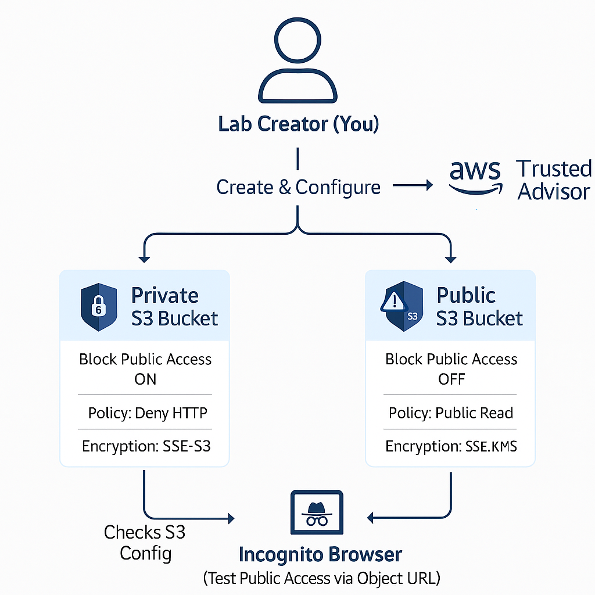

## AWS S3 Security Lab

Implemented, tested, and documented S3 bucket security configurations and public access detection in AWS. Covered creation, policy and encryption management, public access simulation, and misconfiguration detection using AWS Trusted Advisor.

---

## Table of Contents

- [Overview]
- [Objectives]
- [Steps Performed]
  - [1. S3 Bucket Creation]
  - [2. Bucket Policy Configuration]
  - [3. Bucket Encryption]
  - [4. Public Access Test]
- [5. Misconfiguration Detection]
- [Screenshots]
- [Lessons Learned]
- [References]

---

## Overview

This lab focused on the security lifecycle for Amazon S3 buckets. The workflow included creating both private and intentionally public buckets, applying best-practice access policies, configuring server-side encryption, simulating a misconfiguration, and detecting issues using AWS Trusted Advisor. The steps demonstrate practical skills essential for AWS cloud security roles.

---

## Diagram

---

## Objectives

- Create secure and intentionally misconfigured (public) S3 buckets.
- Apply JSON bucket policies for granular access control.
- Enable and test server-side encryption (SSE-S3, SSE-KMS).
- Simulate and verify public access to S3 objects.
- Detect misconfiguration with AWS Trusted Advisor (noting account limitations).

---

## Steps Performed

1. S3 Bucket Creation
   - Created two S3 buckets: 
      - One private (sebastiansilva-private-bucket) 
      - One intentionally public (sebastiansilva-public-bucket)
   - Verified creation via S3 bucket list in AWS Console.

2. Bucket Policy Configuration
   - Private bucket: Attached a policy that denies access over HTTP, requiring HTTPS for all requests.
   - Public bucket: Attached a policy that allows public read access (for lab/testing only).

3. Bucket Encryption
   - Enabled SSE-S3 (Amazon managed keys) for the private bucket.
   - Enabled SSE-KMS (AWS KMS customer-managed key) for the public bucket.

4. Public Access Test
   - Uploaded a test file (hello.txt) to the public bucket.
   - Validated that the file could be accessed from an incognito browser, confirming the misconfiguration.

5. Misconfiguration Detection
   - Attempted to use AWS Trusted Advisor to detect the public bucket.
   - Noted that the Free Tier does not provide this check; included manual verification and documentation.

---

## Screenshots

*All relevant screenshots demonstrating each step are included in the screenshots/ folder of this repository.

| Order | File Name                            | What it Shows                                       |
|-------|--------------------------------------|-----------------------------------------------------|
| 1     | s3-bucket-list.png                   | List of S3 buckets: private and public buckets      |
| 2     | private-bucket-policy.png            | Private bucket policy requiring HTTPS               |
| 3     | public-bucket-policy.png             | Public bucket policy allowing public read access    |
| 4     | private-bucket-encryption.png        | SSE-S3 encryption enabled on private bucket         |
| 5     | public-bucket-encryption.png         | SSE-KMS encryption enabled on public bucket         |
| 6     | private-bucket-permissions.png       | Block Public Access ON for private bucket           |
| 7     | public-bucket-permissions.png        | Block Public Access OFF for public bucket           |
| 8     | public-bucket-file-public-access.png | Successful public file access from incognito browser|
| 9     | trusted-advisor-no-s3-check.png      | Trusted Advisor showing no S3 checks (Free Tier)    |

## Screenshot Explanations

1. s3-bucket-list.png: Shows both S3 buckets created for the lab.

2. private-bucket-policy.png: JSON policy attached to the private bucket to enforce HTTPS access.

3. public-bucket-policy.png: JSON policy attached to the public bucket, allowing public read for demonstration.

4. private-bucket-encryption.png: Confirmation that SSE-S3 encryption is enabled on the private bucket.

5. public-bucket-encryption.png: Confirmation that SSE-KMS encryption is enabled on the public bucket.

6. private-bucket-permissions.png: Block Public Access enabled on the private bucket (default secure setting).

7. public-bucket-permissions.png: Block Public Access disabled on the public bucket (misconfiguration for testing).

8. public-bucket-file-public-access.png: Public test file (hello.txt) successfully accessed from an incognito browser.

9. trusted-advisor-no-s3-check.png: Trusted Advisor page, documenting that S3 security checks require a higher support plan.

---

## Lessons Learned

- S3 bucket misconfigurations are a common source of cloud data breaches.
- AWS provides robust tools for securing and monitoring S3, but proper policy and encryption configuration is critical.
- Public access risks should be detected both automatically (e.g., Trusted Advisor) and manually.
- Understanding AWS Free Tier limitations is important for documentation and real-world troubleshooting.

---

## References

- AWS S3 Documentation
  https://docs.aws.amazon.com/AmazonS3/latest/userguide/Welcome.html

- AWS S3 Bucket Policies
  https://docs.aws.amazon.com/AmazonS3/latest/userguide/example-bucket-policies.html

- AWS S3 Encryption
  https://docs.aws.amazon.com/AmazonS3/latest/userguide/UsingServerSideEncryption.html

- AWS Trusted Advisor
  https://docs.aws.amazon.com/awssupport/latest/user/trusted-advisor.html

Note:
Some AWS-managed or service-linked roles cannot be deleted manually and are retained by AWS for service management. Full Trusted Advisor checks (including S3 public bucket detection) require a Business or Enterprise support plan. For this lab, public access was validated manually.

---

Sebastian Silva C. – July 2025 – Berlin, Germany
